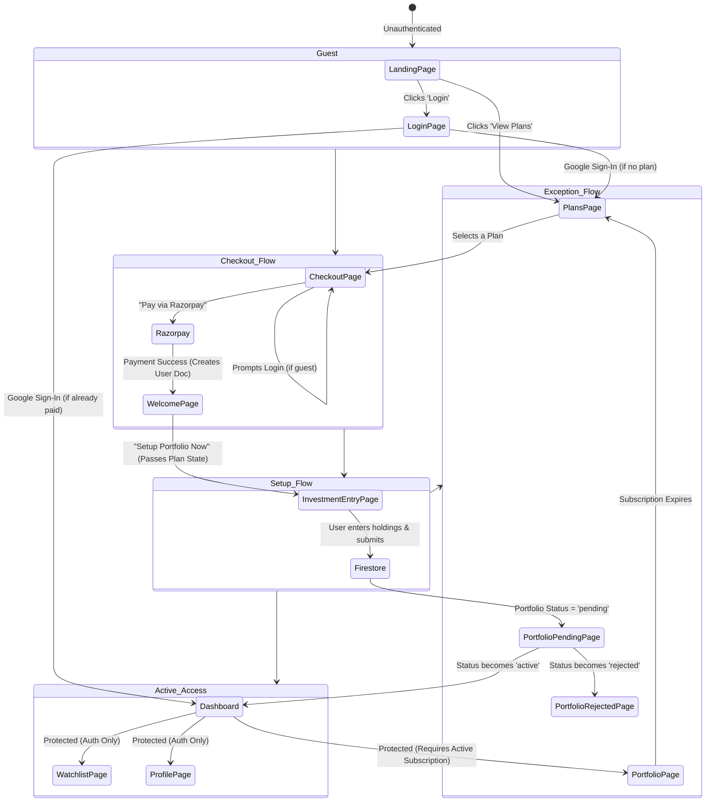
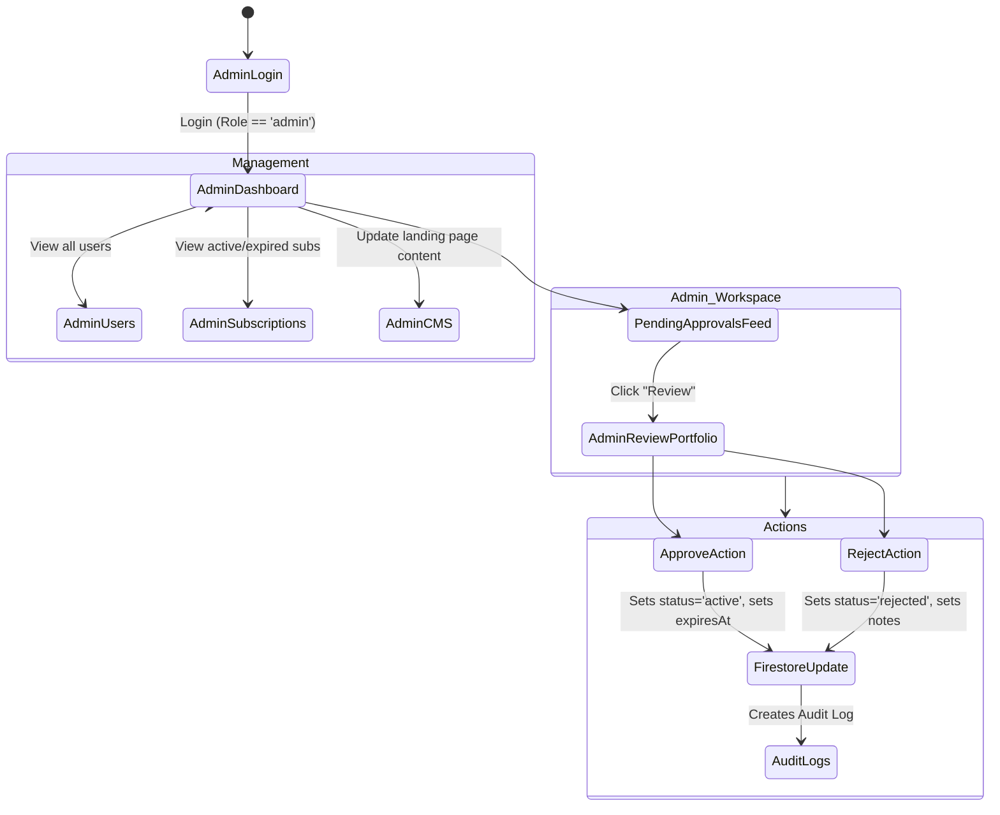
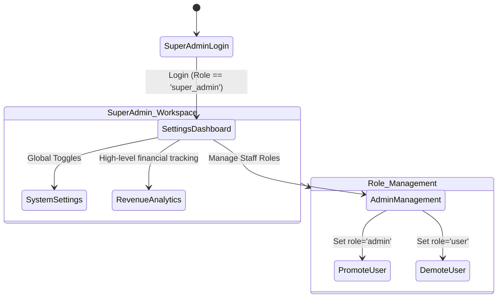
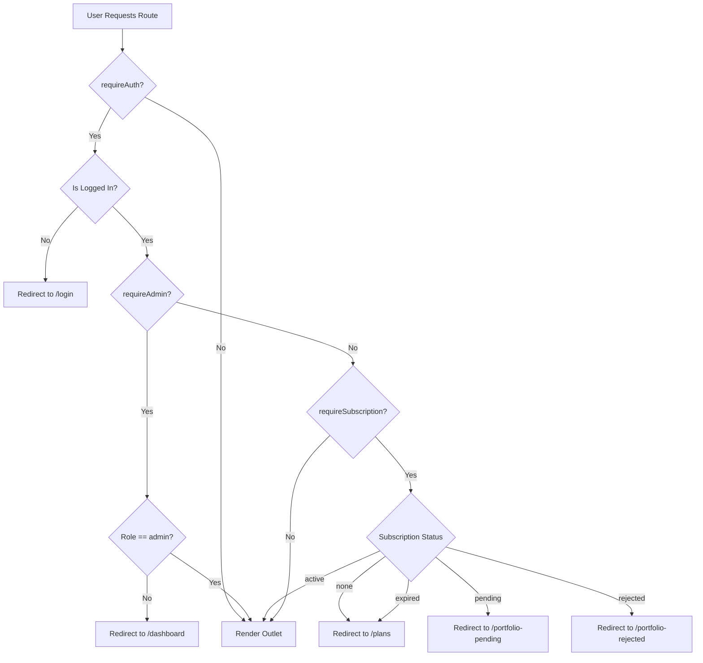

# Arth Research – Complete Application Flows

This document details the exact navigational and data flows across the platform for Users, Administrators, and Super Admins. It includes comprehensive state diagrams indicating which pages are rendered under specific conditions and what data is shared between them.

---

## 1. User Journey (Onboarding & Access Flow)

The User Journey handles everything from a guest visiting the landing page to purchasing a plan, setting up a portfolio, waiting for approval, and finally accessing the secure wealth engine terminal.

### **Diagrammatic Flow**

### **Page-by-Page Data Details**
*   **`/` (Landing Page)**: Public page. Loads CMS data.
*   **`/plans` (Plans Page)**: Public. Fetches `plans` collection from Firestore. Displays pricing.
*   **`/login` (Login Page)**: Authenticates via Firebase Google Auth. Redirects to previous route (via `location.state.from`) or to `/dashboard`.
*   **`/checkout/:planId` (Checkout Page)**: Requires auth to pay. Displays plan details. On payment success, updates `users` collection and navigates to `/checkout/success`.
*   **`/checkout/success` (Welcome Page)**: Reads `planId` and displays invoice. Navigates to `/setup-portfolio` passing plan details in React Router `state`.
*   **`/setup-portfolio` (Investment Entry Page)**: 
    *   **Data Read**: Reads `user` auth state, `plan` from router state, checks for existing `portfolios` in Firestore.
    *   **Data Write**: Creates a new document in `portfolios` collection with `status: 'pending'`, user's entered `stocks`, `totalInvestment`, and `userId`.
*   **`/portfolio-pending`**: Polling/listening screen waiting for admin approval.
*   **`/dashboard` (Dashboard)**: Uses `AuthGuard`. Reads `useAuthStore` and `usePortfolioStore`. If user has no portfolio, shows "Access Denied" overlay.
*   **`/portfolio`**: Protected by `requireSubscription` in `AuthGuard`. Accessible only if `portfolio.status === 'active'` and `expiresAt` > Date.now().

---

## 2. Administrator Flow (Review & Management)

Admins are responsible for verifying new user portfolios, approving or rejecting them, and managing content.

### **Diagrammatic Flow**

### **Page-by-Page Data Details**
*   **`/admin/dashboard`**: Fetches aggregate stats (Total Users, Active Portfolios, Pending Approvals).
*   **`/admin/review-portfolio/:id`**: 
    *   **Data Read**: Fetches the specific `portfolio` document and the associated `user` document.
    *   **Approve Action**: Updates `portfolios` doc: `status = 'active'`, `approvedAt = Timestamp`, `expiresAt = Timestamp + validityDays`.
    *   **Reject Action**: Updates `portfolios` doc: `status = 'rejected'`, `adminNotes = Reason`.
    *   **Audit**: Writes a new document to `audit_logs` collection detailing who approved/rejected what and when.
*   **`/admin/users`**: Lists all documents in `users` collection. Can click into a specific user to view their portfolio state.
*   **`/admin/cms`**: Reads and writes to a central `cms` document to update text on the Landing Page, Login Page, and Welcome Page.

---

## 3. Super Admin Flow (System & Role Management)

The Super Admin (typically the business owner) has all standard Admin capabilities, plus the ability to manage other admins, change system-wide settings, and oversee platform economics. *(Note: This assumes a `role: 'super_admin'` structure built on top of standard admin).*

### **Diagrammatic Flow**

### **Page-by-Page Data Details**
*   **`/admin/settings` (System Settings)**: 
    *   **Data Write**: Modifies global configurations (e.g., locking the platform, updating global API keys if stored securely in Firebase, or setting maintenance modes).
*   **`/admin/users` (Role Management)**:
    *   **Data Write**: A Super Admin can modify the `role` field on a `user` document. Changing a user from `user` -> `admin` instantly grants them access to the `/admin/*` routes due to `AuthGuard` re-evaluation.
*   **Audit Oversight**: Super Admins have read access to all `audit_logs` to ensure standard Admins are properly reviewing portfolios without abuse.

---

## 4. AuthGuard & Protection Flow (The Gatekeeper)

Every route transition in the application passes through the `AuthGuard` logic. This ensures data security is maintained at the routing layer before reaching the Firebase security rules.

### **Data Dependencies for AuthGuard**
*   `useAuthStore` relies heavily on the `auth_sync_channel` (BroadcastChannel) to keep multiple tabs in sync.
*   `subscriptionStatus` is dynamically calculated by checking the `portfolio.status` and `portfolio.expiresAt` against `Date.now()`.
*   If a session expires naturally while the user is logged in, the `AuthGuard` will automatically demote them back to `/plans` on their next route navigation.
