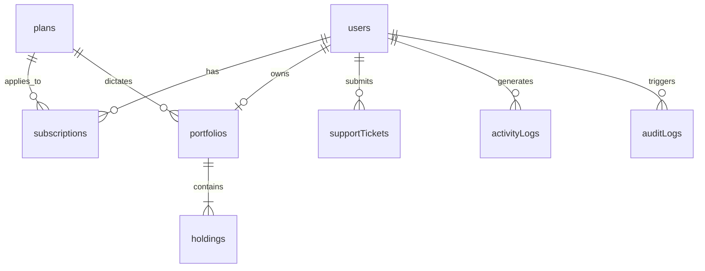
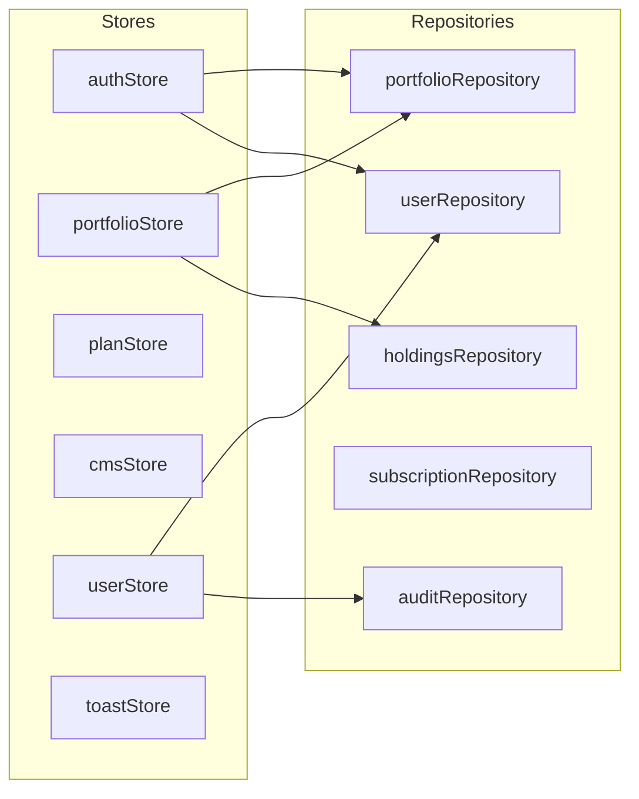

# Arth Research Application - Master Project Documentation & Architecture Specification

---

## 1. Project Overview & Vision

### 1.1 The Core Idea
**Arth Research Application** is a wealth management, portfolio tracking, and quantitative research investment platform. It bridges the gap between expert financial research and active retail investors.

The platform provides:
1. **Tiered Advisory & Research Plans**: Users subscribe to specialized research strategies (e.g., *Wealth Multiplier Pro*, *Momentum Alpha*, *Dividend Shield*).
2. **Guided Portfolio Ingestion & Sync**: Subscribers submit their current stock holdings and buy prices during onboarding.
3. **Real-time Performance & Tracking**: Live calculation of Profit & Loss (PnL), market trajectory, asset allocation, and stock recommendations.
4. **Full Administrative Governance**: An enterprise admin terminal for reviewing and approving investor portfolios, managing subscriptions, extending validity periods, dynamically managing site copy (CMS), handling support tickets, and inspecting audit trails.

### 1.2 Design Philosophy: Neo-Brutalism
The user interface adheres strictly to a high-contrast **Neo-brutalist** aesthetic:
- **Borders**: 4px solid pitch black (`border-4 border-black`) on all cards, buttons, dialogs, and inputs.
- **Radii**: Sharp $0\text{px}$ corners (no border-radius on cards or containers).
- **Shadows**: Distinct, unblurred block shadows:
  - Default: `shadow-neo` (`4px 4px 0px #000`)
  - Large: `shadow-neo-lg` (`8px 8px 0px #000`)
  - Small: `shadow-neo-sm` (`2px 2px 0px #000`)
  - Pressed: `shadow-neo-pressed` (`translate(4px, 4px)`)
- **Palette**: High-saturation accents on clean backdrops:
  - Primary (`--color-neo-primary`): `#FFDF00` (Vibrant Canary Yellow)
  - Secondary (`--color-neo-secondary`): `#FF90E8` (Neon Magenta / Pink)
  - Accent (`--color-neo-accent`): `#38BDF8` (Bright Cyber Blue)
  - Success (`--color-neo-success`): `#10B981` (Emerald Green)
  - Danger (`--color-neo-danger`): `#EF4444` (Vibrant Red)
  - Background (`--color-neo-bg`): `#FFFFFF` with custom dot-matrix grid (`radial-gradient(#E5E7EB 1px, transparent 1px)`).
- **Typography & Icons**: Heavy font weights (`font-black`, `uppercase`, `tracking-tighter`) combined with `lucide-react` icons configured with bold `stroke-[3]` lines.

---

## 2. Technology Stack & Directory Structure

### 2.1 Core Technologies
- **Frontend Framework**: React 19 (Strict Mode, Lazy-loaded Suspense modules)
- **Language**: TypeScript (Strict typing across models, contracts, stores, and repositories)
- **Bundler & Tooling**: Vite + Oxlint
- **Styling**: Tailwind CSS v4
- **State Management**: Zustand
- **Backend as a Service (BaaS)**: Firebase Authentication + Cloud Firestore (Modular SDK v9+)
- **Charts & Data Visualization**: Recharts (Area Charts, Responsive Containers)
- **Motion & Transitions**: Framer Motion
- **Icons**: Lucide React
- **Routing**: React Router DOM (v7)

### 2.2 Directory Structure
```
ArthResearchApplication/
├── docs/                        # Complete design, database & architectural guides
│   ├── 01-project-overview.md
│   ├── 02-design-system.md
│   ├── 05-database-schema.md
│   ├── 06-api-contracts.md
│   ├── 07-folder-structure.md
│   ├── 08-components.md
│   ├── 09-pages.md
│   ├── 10-coding-rules.md
│   └── MASTER-PROJECT-DOCUMENTATION.md
├── public/                      # Static assets & icons
├── src/
│   ├── assets/                  # Images & logo artwork
│   ├── components/              # Shared UI & system components
│   │   ├── skeletons/           # Loading skeleton placeholders
│   │   ├── AdminStockSearch.tsx
│   │   ├── AppBootstrap.tsx     # Initializes auth listeners & dynamic config
│   │   ├── AuthGuard.tsx        # Multi-tiered route protector
│   │   ├── ConfirmDialog.tsx    # Neo-brutalist action confirmation modal
│   │   ├── EmptyState.tsx       # Placeholder UI for empty collections
│   │   ├── ErrorBoundary.tsx    # React error boundary
│   │   ├── NetworkSecurityGuard.tsx # Offline/online connection monitor
│   │   ├── Preloader.tsx        # Initial splash loader
│   │   ├── ProtectedRoute.tsx
│   │   ├── SystemErrorBoundary.tsx
│   │   ├── ToastContainer.tsx   # Global neo-brutalist toast dispatcher
│   │   └── TopNavBar.tsx
│   ├── config/
│   │   └── firebase.ts          # Firebase SDK initialization & exports (auth, db)
│   ├── hooks/
│   │   └── useNetworkStatus.ts  # Online/offline browser hook
│   ├── layouts/
│   │   ├── AdminLayout.tsx      # Sidebar + Header container for /admin routes
│   │   └── UserLayout.tsx       # Navigation + Top bar container for investor app
│   ├── lib/
│   │   └── utils.ts             # Tailwind class merge helper (cn)
│   ├── pages/                   # Application views
│   │   ├── admin/               # Admin panel pages
│   │   │   ├── AdminApprovals.tsx
│   │   │   ├── AdminCMS.tsx
│   │   │   ├── AdminContentHub.tsx
│   │   │   ├── AdminDashboard.tsx
│   │   │   ├── AdminReviewPortfolio.tsx
│   │   │   ├── AdminSettings.tsx
│   │   │   ├── AdminSubscriptions.tsx
│   │   │   ├── AdminSupport.tsx
│   │   │   ├── AdminUserPortfolio.tsx
│   │   │   └── AdminUsers.tsx
│   │   ├── ApprovalPendingPage.tsx
│   │   ├── CheckoutPage.tsx
│   │   ├── DashboardPage.tsx
│   │   ├── HistoryPage.tsx
│   │   ├── InvestmentEntryPage.tsx
│   │   ├── LandingPage.tsx
│   │   ├── LoginPage.tsx
│   │   ├── NotFoundPage.tsx
│   │   ├── NotificationsPage.tsx
│   │   ├── PlansPage.tsx
│   │   ├── PortfolioPage.tsx
│   │   ├── PortfolioPendingPage.tsx
│   │   ├── PortfolioRejectedPage.tsx
│   │   ├── ProfilePage.tsx
│   │   ├── SupportPage.tsx
│   │   ├── WatchlistPage.tsx
│   │   └── WelcomePage.tsx
│   ├── repositories/            # Data Access Layer (Firestore queries & mutations)
│   │   ├── auditRepository.ts
│   │   ├── holdingsRepository.ts
│   │   ├── portfolioRepository.ts
│   │   ├── subscriptionRepository.ts
│   │   └── userRepository.ts
│   ├── services/                # External API integrations
│   ├── stores/                  # Zustand state stores
│   │   ├── authStore.ts
│   │   ├── cmsStore.ts
│   │   ├── planStore.ts
│   │   ├── portfolioStore.ts
│   │   ├── supportStore.ts
│   │   ├── toastStore.ts
│   │   └── userStore.ts
│   ├── types/                   # TypeScript interfaces & enums
│   │   ├── index.ts
│   │   └── models.ts
│   ├── utils/                   # Helpers
│   │   ├── emailService.ts      # Automated email notification mock
│   │   └── securityGuard.ts
│   ├── App.tsx                  # Root routing & layout composition
│   ├── index.css                # Tailwind theme tokens & neo-brutalist utilities
│   └── main.tsx                 # React DOM root entry
├── firestore.rules              # Firebase Security Rules
├── package.json
└── vite.config.ts
```

---

## 3. Database Schema & Firestore Architecture

The database is built on Cloud Firestore using normalized collections with dedicated subcollections.



### 3.1 `users` Collection
*Document ID*: Firebase Auth UID (`user.uid`)

| Field | Type | Description |
|---|---|---|
| `uid` | `string` | Primary Key matching Firebase Auth UID |
| `email` | `string` | User's Google Account email |
| `displayName` | `string` | Full name |
| `photoURL` | `string` (optional) | Profile avatar URL |
| `role` | `enum` | `'user' \| 'admin' \| 'super_admin' \| 'support' \| 'finance' \| 'research_admin'` |
| `status` | `'active' \| 'suspended'` | Account active state |
| `emailVerified` | `boolean` | Email verification flag |
| `createdAt` | `string` (ISO) | Registration timestamp |
| `lastLogin` | `string` (ISO) | Last authentication timestamp |
| `phone` | `string` (optional) | Mobile number |
| `riskProfile` | `'Low' \| 'Medium' \| 'High'` | Risk questionnaire assessment |
| `investmentExperience` | `string` | Experience level (e.g. `1-3 years`) |
| `panNumber` | `string` | Compliance / tax identifier |
| `kycCompleted` | `boolean` | Verification status |

### 3.2 `plans` Collection
*Document ID*: Auto-generated Firestore ID

| Field | Type | Description |
|---|---|---|
| `id` | `string` | Plan identifier |
| `name` | `string` | Tier name (e.g. "Wealth Multiplier Pro") |
| `description` | `string` | High-level summary of the strategy |
| `price` | `number` | Price in INR (₹) |
| `validityDays` | `number` | Duration of access in days (e.g. `30`, `90`, `365`) |
| `category` | `string` | Strategy category (`equity`, `fno`, `hybrid`) |
| `riskLevel` | `string` | `'Low' \| 'Medium' \| 'High'` |
| `expectedCagr` | `number` | Projected historical/targeted return (e.g. `28.5%`) |
| `minInvestment` | `number` | Minimum recommended capital (e.g. `₹50,000`) |
| `stockLimit` | `number` | Maximum stocks allowed in this strategy |
| `features` | `string[]` | Bulleted list of subscriber benefits |
| `recommendedStocks` | `string[]` | Default recommended stock tickers (e.g. `["RELIANCE", "TCS", "INFY"]`) |
| `isActive` | `boolean` | Visibility in marketplace |
| `isPopular` | `boolean` | "Most Popular" highlight badge flag |

### 3.3 `portfolios` Collection & `holdings` Subcollection
*Document ID*: Auto-generated Firestore ID

| Field | Type | Description |
|---|---|---|
| `id` | `string` | Portfolio document ID |
| `userId` | `string` | Foreign key referencing `users.uid` |
| `planId` | `string` | Foreign key referencing `plans.id` |
| `planName` | `string` | Denormalized plan name |
| `status` | `enum` | `'not_created' \| 'draft' \| 'pending' \| 'active' \| 'rejected' \| 'expired'` |
| `totalInvestment` | `number` | Sum of all `(quantity * buyPrice)` |
| `stockCount` | `number` | Total number of holdings |
| `submittedAt` | `string` (ISO) | Submission timestamp |
| `approvedAt` | `string` (ISO) | Admin approval timestamp |
| `approvedBy` | `string` | Admin UID who approved |
| `rejectedAt` | `string` (ISO) | Admin rejection timestamp |
| `rejectedBy` | `string` | Admin UID who rejected |
| `rejectionReason` | `string` (optional) | Note provided to user on rejection |
| `expiresAt` | `number` (Epoch ms) | Expiration timestamp: `Date.now() + (validityDays * 86400000)` |
| `createdAt` | `string` (ISO) | Creation timestamp |
| `updatedAt` | `string` (ISO) | Last modified timestamp |

#### Subcollection: `portfolios/{portfolioId}/holdings`
*Document ID*: Auto-generated Firestore ID

| Field | Type | Description |
|---|---|---|
| `id` | `string` | Holding ID |
| `portfolioId` | `string` | Parent portfolio document ID |
| `symbol` | `string` | NSE/BSE Stock Ticker (e.g. "HDFCBANK") |
| `companyName` | `string` | Full corporate name |
| `quantity` | `number` | Number of shares entered by user |
| `buyPrice` | `number` | Average purchase price entered by user |
| `investment` | `number` | Calculated as `quantity * buyPrice` |
| `currentPrice` | `number` (optional) | Live/simulated market price |
| `currentValue` | `number` (optional) | Calculated as `quantity * currentPrice` |
| `pnl` | `number` (optional) | Net profit/loss |
| `allocation` | `number` (optional) | Portfolio weight percentage |
| `createdAt` | `string` (ISO) | Timestamp |

### 3.4 `subscriptions` Collection
*Document ID*: Auto-generated Firestore ID
Tracks purchase transactions and recurring memberships.
- `userId`, `planId`, `planName`, `pricePaid`, `validityDays`, `status` (`'pending' | 'active' | 'rejected' | 'expired'`), `purchaseDate`, `expiresAt`.

### 3.5 `settings` Collection (Dynamic Admin CMS)
Stores copy and configuration editable via `/admin/cms`:
- **`landingPage`**: Hero title, subtitle, AUM stat, Win-rate stat, About text.
- **`welcomePage`**: Title, subtitle, action button text.
- **`plansPage`**: Title, subtitle, badge copy.
- **`dashboardPage`**: Welcome text, market status banner, chart title.

### 3.6 `auditLogs` Collection
Captures audit events created by admins:
- `adminId`, `adminEmail`, `action` (e.g. `"APPROVE_PORTFOLIO"`, `"EXTEND_PORTFOLIO_30_DAYS"`), `targetId`, `targetType`, `details`, `timestamp`.

---

## 4. Complete Application Pages Specification

```mermaid
graph TD
    subgraph Public
        L[LandingPage /]
        LP[LoginPage /login]
        P[PlansPage /plans]
    end

    subgraph Checkout & Onboarding
        C[CheckoutPage /checkout/:planId]
        W[WelcomePage /checkout/success]
        IE[InvestmentEntryPage /setup-portfolio]
        PP[PortfolioPendingPage /portfolio-pending]
        PR[PortfolioRejectedPage /portfolio-rejected]
    end

    subgraph Investor App (UserLayout)
        D[DashboardPage /dashboard]
        PF[PortfolioPage /portfolio]
        WL[WatchlistPage /watchlist]
        H[HistoryPage /history]
        N[NotificationsPage /notifications]
        SP[SupportPage /support]
        PRFL[ProfilePage /profile]
    end

    subgraph Admin Terminal (AdminLayout)
        AD[AdminDashboard /admin/dashboard]
        AU[AdminUsers /admin/users]
        AUP[AdminUserPortfolio /admin/users/:userId/portfolio]
        AA[AdminApprovals /admin/approvals]
        ARP[AdminReviewPortfolio /admin/review-portfolio/:id]
        AS[AdminSubscriptions /admin/subscriptions]
        ACMS[AdminCMS /admin/cms]
        ACH[AdminContentHub /admin/content]
        ASUP[AdminSupport /admin/support]
        ASET[AdminSettings /admin/settings]
    end

    L --> LP
    L --> P
    P --> C
    C --> W
    W --> IE
    IE --> PP
    PP -. Admin Approves .-> PF
    PF --> D
```

### 4.1 Public & Unauthenticated Pages

#### 1. Landing Page (`/` - `LandingPage.tsx`)
- **Purpose**: Showcase the platform's core value proposition, track record, market insights, pricing tiers, and client reviews.
- **Key Features**:
  - Hero section with live CMS data (`heroTitle`, `heroSubtitle`, `statsAum`, `statsWinRate`).
  - Interactive performance metrics and ticker animations.
  - Plan previews with direct link to `/checkout/:planId`.
  - Neo-brutalist interactive FAQ and Testimonials cards.

#### 2. Login Page (`/login` - `LoginPage.tsx`)
- **Purpose**: Single sign-on entry point.
- **Features**:
  - One-click Google Sign-In via `loginWithGoogle()`.
  - Automatic routing: Admins are directed to `/admin/dashboard`, standard users to `/dashboard` (or the previous page they attempted to access).
  - Security and compliance badges.

#### 3. Plans Marketplace (`/plans` - `PlansPage.tsx`)
- **Purpose**: Explore all active investment plans with detailed comparisons.
- **Features**:
  - Tiers with expected CAGR, risk meters, stock limits, and minimum capital requirements.
  - Category filters: *All*, *Equity*, *F&O*, *Hybrid*.
  - Direct checkout trigger passing the selected `planId`.

---

### 4.2 Checkout & Ingestion Pages

#### 4. Checkout Page (`/checkout/:planId` - `CheckoutPage.tsx`)
- **Purpose**: Payment breakdown, coupon code validation, and order confirmation.
- **Features**:
  - Breakdown of Plan Price, GST (18%), and dynamic coupon discounts.
  - Terms of Service acceptance check.
  - Seamless redirection to `/checkout/success` on transaction completion.

#### 5. Welcome & Post-Checkout Page (`/checkout/success` - `WelcomePage.tsx`)
- **Purpose**: Confirmation of subscription purchase.
- **Features**:
  - Congratulatory screen with dynamic copy from `cmsStore`.
  - Call-to-action taking the user directly to `/setup-portfolio`.

#### 6. Investment Entry Page (`/setup-portfolio` - `InvestmentEntryPage.tsx`)
- **Purpose**: User portfolio creation and stock entry form.
- **Features**:
  - Dynamic multi-row stock entry form (`Symbol`, `Company Name`, `Quantity`, `Buy Price`).
  - Pre-fills plan recommendations if provided.
  - Live total capital allocation counter and stock count validation.
  - Saves portfolio document with `status: 'pending'` and writes individual holding documents in the `holdings` subcollection via `portfolioRepository.addHoldings()`.
  - Automatically routes user to `/portfolio-pending`.

#### 7. Portfolio Pending Page (`/portfolio-pending` - `PortfolioPendingPage.tsx`)
- **Purpose**: Waiting room while research analysts review submitted stock allocations.
- **Features**:
  - Status stepper: *Submitted* -> *In Review* -> *Awaiting Approval*.
  - Displays submitted stock summary and timestamp.
  - Automatic redirect once the administrator approves the portfolio.

#### 8. Portfolio Rejected Page (`/portfolio-rejected` - `PortfolioRejectedPage.tsx`)
- **Purpose**: Informs user if their portfolio was declined by an analyst.
- **Features**:
  - Displays the specific rejection note from `portfolio.rejectionReason`.
  - "Resubmit Portfolio" button redirecting back to `/setup-portfolio`.

#### 9. Approval Pending Page (`/pending-approval` - `ApprovalPendingPage.tsx`)
- **Purpose**: Global holding page for any account awaiting verification.

---

### 4.3 Investor Application (User Layout - `/layouts/UserLayout.tsx`)

#### 10. Dashboard Page (`/dashboard` - `DashboardPage.tsx`)
- **Purpose**: Daily terminal overview for the investor.
- **Features**:
  - Portfolio Value, Total Invested, Net PnL (₹ and %), and Win Rate cards.
  - Recharts Area Chart plotting monthly performance trajectories.
  - Quick access buttons to Watchlist, Notifications, and Holdings.

#### 11. Portfolio Page (`/portfolio` - `PortfolioPage.tsx`)
- **Purpose**: In-depth stock-by-stock breakdown of the active investment plan.
- **Features**:
  - Guarded: Only accessible when `subscriptionStatus === SubscriptionStatus.ACTIVE` and `expiresAt > Date.now()`.
  - Holdings table with Symbol, Quantity, Buy Price, Current Value, PnL (₹ and %), and Portfolio Weight Allocation.
  - Expiration countdown indicator with renewal alerts.

#### 12. Watchlist Page (`/watchlist` - `WatchlistPage.tsx`)
- **Purpose**: Track target stocks and analyst recommendations in real time.

#### 13. History Page (`/history` - `HistoryPage.tsx`)
- **Purpose**: Historical audit trail of past subscriptions, previous portfolios, and rebalancing events.

#### 14. Notifications Page (`/notifications` - `NotificationsPage.tsx`)
- **Purpose**: Actionable alerts regarding market openings, plan rebalancing, and subscription renewals.

#### 15. Support Page (`/support` - `SupportPage.tsx`)
- **Purpose**: User ticket submission interface with priority selection and response history.

#### 16. Profile Page (`/profile` - `ProfilePage.tsx`)
- **Purpose**: Account management, personal details, risk profiling, compliance pan/KYC, and logout.

---

### 4.4 Admin Terminal (Admin Layout - `/layouts/AdminLayout.tsx`)

#### 17. Admin Dashboard (`/admin/dashboard` - `AdminDashboard.tsx`)
- **Purpose**: Platform KPI monitoring hub.
- **Features**:
  - Aggregate metrics: Total Registered Users, Active Portfolios, Total AUM, Pending Approvals.
  - Live Audit Log stream showing recent admin actions.

#### 18. Admin Approvals (`/admin/approvals` - `AdminApprovals.tsx`)
- **Purpose**: Triage and manage all incoming subscriber portfolios.
- **Features**:
  - Searchable list of all submitted portfolios filtered by `pending`, `active`, `rejected`.
  - **1-Click Approval**: Calculates expiration date based on the plan's `validityDays` (`Date.now() + plan.validityDays * 86400000`), sets `status: 'active'`, and triggers notification email.
  - **Rejection with Reason**: Prompts for rejection feedback, sets `status: 'rejected'`.
  - **30-Day Extension**: Adds 30 days (`30 * 86400000` ms) to `expiresAt`.

#### 19. Admin Review Portfolio (`/admin/review-portfolio/:id` - `AdminReviewPortfolio.tsx`)
- **Purpose**: Deep-dive inspection of a specific investor's holdings before approval.
- **Features**:
  - Full breakdown of stock quantities, purchase costs, and weights.
  - Allows editing, adding, or deleting stocks from the user's submission prior to final approval.

#### 20. Admin Users (`/admin/users` - `AdminUsers.tsx`)
- **Purpose**: User directory and role management.
- **Features**:
  - Search by email, name, or UID.
  - Role management (promote to Admin, demote to User).
  - Direct navigation to view any user's portfolio.

#### 21. Admin User Portfolio (`/admin/users/:userId/portfolio` - `AdminUserPortfolio.tsx`)
- **Purpose**: Direct inspection and manual override of a specific user's portfolio and holdings.

#### 22. Admin Subscriptions (`/admin/subscriptions` - `AdminSubscriptions.tsx`)
- **Purpose**: Revenue and subscription tier monitoring.

#### 23. Admin CMS (`/admin/cms` - `AdminCMS.tsx`)
- **Purpose**: Dynamic Content Management System.
- **Features**:
  - Real-time editing of Landing page titles, subtitles, statistics, About us copy, and Welcome page instructions.
  - Updates the `settings` collection in Firestore, immediately reflected across the app.

#### 24. Admin Content Hub (`/admin/content` - `AdminContentHub.tsx`)
- **Purpose**: Publish market updates, research notes, and commentary for subscribers.

#### 25. Admin Support (`/admin/support` - `AdminSupport.tsx`)
- **Purpose**: Manage and reply to user support inquiries.

#### 26. Admin Settings (`/admin/settings` - `AdminSettings.tsx`)
- **Purpose**: System health, maintenance mode toggles, and compliance controls.

---

## 5. State Management & Data Flow Architecture

The application utilizes **Zustand** stores designed around specific business domains:



### 5.1 `authStore.ts`
- **State**: `user` (FirebaseUser), `dbUser` (Firestore User model), `isAdmin` (boolean), `isInitializing` (boolean), `subscriptionStatus` (`SubscriptionStatus`).
- **Capabilities**:
  - Multi-tab synchronization using a `BroadcastChannel('auth_sync_channel')`.
  - Automatic `onAuthStateChanged` listener that fetches user profile and current portfolio to calculate `subscriptionStatus` on every reload.

### 5.2 `portfolioStore.ts`
- **State**: `userPortfolio` (Portfolio), `holdings` (PortfolioHolding[]), `allPortfolios` (Portfolio[]), `isLoading` (boolean).
- **Capabilities**:
  - `initPortfolioListener(userId)`: Establishes realtime Firestore `onSnapshot` listeners on both the user's `portfolio` document and its `holdings` subcollection.
  - Clean unsubscription handlers to prevent memory leaks on logout.

### 5.3 `planStore.ts`
- **State**: `plans` (Plan[]), `isLoadingPlans` (boolean).
- **Capabilities**: Fetches active plans from the `plans` collection or seeds default initial plans if the database is empty.

### 5.4 `cmsStore.ts`
- **State**: `siteContent` (dynamic settings dictionary), `isLoading` (boolean).
- **Capabilities**: Fetches and caches dynamic text settings from Firestore `settings` collection.

### 5.5 `toastStore.ts`
- **State**: Queue of active toasts with variants (`success`, `error`, `info`, `warning`).
- **Capabilities**: Dispatches neo-brutalist alert popups with automatic dismissal timers.

---

## 6. Access Control & Security Matrix

Access is enforced at both the client routing level (`AuthGuard.tsx`) and the database level (`firestore.rules`):

| Route | Minimum Requirement | If Unauthenticated | If Expired / Inactive |
|---|---|---|---|
| `/` | Public | Allowed | Allowed |
| `/login` | Public | Allowed | Redirects to `/dashboard` |
| `/plans` | Public | Allowed | Allowed |
| `/checkout/:planId` | Logged In | Redirects to `/login` | Allowed |
| `/setup-portfolio` | Logged In | Redirects to `/login` | Allowed |
| `/portfolio-pending` | Logged In | Redirects to `/login` | Allowed |
| `/dashboard` | Logged In | Redirects to `/login` | Allowed |
| `/portfolio` | Active Subscription | Redirects to `/login` | Redirects to `/plans` with `subscription_expired` |
| `/history` | Active Subscription | Redirects to `/login` | Redirects to `/plans` |
| `/admin/*` | Role: `admin` \| `super_admin` | Redirects to `/login` | Redirects to `/dashboard` |

---

## 7. Current Project Implementation Status

As of today, the codebase contains:
- **100% Complete Neo-Brutalist Design System** with custom Tailwind v4 tokens and responsive layout wrappers.
- **Complete Route Architecture** with lazy loading, fallback modules, and multi-tier authentication gating.
- **Normalized Data Architecture** with dedicated repositories for Users, Portfolios, Holdings, Subscriptions, and Audit Logs.
- **Investor Onboarding Pipeline**: Plan selection $\to$ Checkout $\to$ Portfolio Stock Setup $\to$ Pending Review Room $\to$ Approved Live Dashboard.
- **Administrative Control Suite**: Approval workflows, 30-day validity extension overrides, stock holding reviews, dynamic CMS site text management, user role assignments, and audit logging.
- **Resilient System Guards**: Global error boundaries, network connectivity guards, and multi-tab auth session synchronization.
